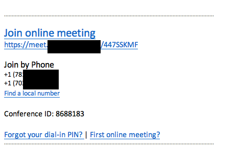

#Today Workflow


Use **today** to open the workflow and **tc** to open the config menu


This workflow will query an EWS (Exchange Web Service) and pull down a list of Today's meetings.

If you are using Skype/Lync and you set the correct regex it will also parse out the Meeting URL

You can click **shift** on an entry to load a **QuickLook** preview of the item.


# Configuration

You can see configuration items with the **tc** command

##**Username** and **Password**

The workflow will extract these entries out of the OSX keychain from the keychain entry for `outlook.office365.com`

If for some reason you do not have this value you will get an error message like:


```bash
security add-generic-password -a USER@DOMAIN -s exchange.password.org -w PASSWORD
```

## Exchange Server


## Regex

If you are using Skype or Lync and embed an online meeting you have can use a regular expression to parse this text out.



  For example if your online meeting URL is `http://meet.alfred.com/alfred/332344` you could use a regex of

```perl
(https:\/\/meet.alfred.com[^"]*)
```
Type **tc** to open the configuration menu, select the Regex Option

And enter your regex


