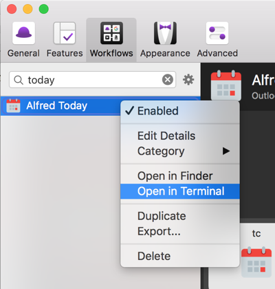
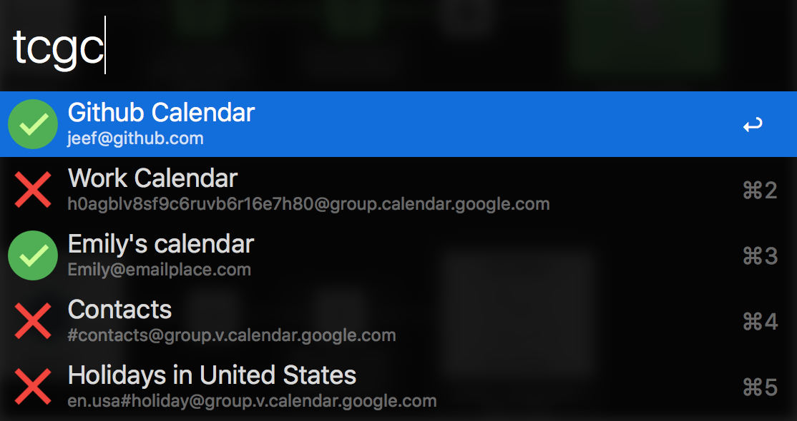

# Today Workflow for Outlook365 and Google Calendar


This workflow will load a **Today** view from both Exchange365 and Google calendars.  It will interleave the events, extract relevant meeting information and allow you to open links directly to your **Hangout** or **Skype** meeting - if one exists.


Version two of this add-on supports both **Google** and **Microsoft Exchange** calendars.

### Version History
* Version 2.0 - Outlook + Google Support
* Version 2.0.1: Exchange Credential Fix
* Version 2.0.2: Dateutil.parser added to lib list
* Version 2.0.3: Correct event time interleaving
* Version 3.0: HUGE SPEEDUPS.  Requires Alfred 3.1
* Version 3.5: Prelim NTLM support (untested)
* Version 3.8: Rewrite of background handling for both Outlook and Exchange


# Installation
Grab the latest release [here](https://github.com/jeeftor/alfredToday/releases)

# Usage

You can use the following commands

Available Commands:

* **Today** (shows the today list)
* **Tomorrow** (shows list for tomorrow)
* **tc** (loads configuration)
* **dbgToday** debug options like open log

# Authenticating against Google Calendar (oauth)

The Google portion of this workflow uses oauth2 to authenticate with google and access your calendar.  When you enabled Google support via the **tc** command the script "should" open a screen in your web browser similar to


When you hit allow this will store a file in you home directory called

```bash
~/.credentials/calendar-alfred-today.json
```
This file is an authorization key that will allow the software to work.  If you are running into issues please ask for help in the [issue](https://github.com/jeeftor/alfredToday/issues) section or on the [alfred forum link](http://www.alfredforum.com/topic/9271-today-view-for-google-calendar-and-microsoft-exchange/?p=46109).

If you want to block access to this application perform a google [Security Checkup](https://security.google.com/settings/security/secureaccount) and look for the item similar to:


and click **Remove**.

Disabling Google support with **tc** will delete the local credentials file.

## Manual Authorization
There are a variety of random reasons why the authorization may not work automatically.  If you are having trouble you can try to manually authorize.

1) First open a terminal window by right clicking on the **Alfred Today** item in your workflow list



2) type `python src/wf_authorize_google.py` in the terminal.  This "should" open a web browser with the option to authorize the application.

If everything works correctly you will see something like this:

```
19:55:06 tools.py:388 INFO
19:55:06 tools.py:389 INFO      ******  AUTHORIZATION SUCCESS  ******
19:55:06 tools.py:390 INFO
```

If there is a problem you will get something like this.

```
19:52:00 tools.py:301 DEBUG    Starting auth function
19:52:00 tools.py:317 INFO
19:52:00 tools.py:318 INFO      ******  AUTH ERROR DETECTED ******
19:52:00 tools.py:319 INFO
19:52:00 tools.py:320 INFO          [Errno 48] Address already in use
19:52:00 tools.py:321 INFO
19:52:00 tools.py:322 INFO      ********* END AUTH ERROR *********
```

If you run into problems open an [issue](https://github.com/jeeftor/alfredToday/issues) and/or post on [alfred forum link](http://www.alfredforum.com/topic/9271-today-view-for-google-calendar-and-microsoft-exchange/?p=46109)

Lastly you can always check to make sure nothing is running on port `8080` with this command: `sudo lsof -i :8080`  If a process (like NGNIX is running on this port you will be unable to complete the authentication process I believe - until you kill the process.


# Exchange Servers

Use **today** to open the workflow and **tc** to open the config menu

This workflow will query an EWS (Exchange Web Service) and pull down a list of Today's meetings.  *It may only work with an office 365 online server, I have built NTLM authentication support but do not have an internal exchange server to test it against so I cannot be sure if it works*

If you are using **Skype/Lync** and you set the correct regex it will also parse out the Meeting URL

You can click **shift** on an entry to load a **QuickLook** preview of the item.


# Configuration

You can see configuration items with the **tc** command and make changes


## **Username** and **Password**

The workflow will extract these entries out of the OSX keychain from the keychain entry for `outlook.office365.com`

If your keychain does not contain this value, or you wish to use a different account than that which is auto detected you can manually set a username and password.


If you've logged into the Outlook / Exchange online website you should have this value.  If auto-detect does not work just select both the **Login** and **Password** options to set the correct credentials for login.

## Exchange Server

This workflow uses a version of PyExchange modified to use **Basic Authorization** instead of **NTLM** to connect to the exchange server.  According to Microsoft NTLM is only available for internal exchange servers - so its possible this workflow will only work with cloud hosted servers.

The default server is `https://outlook.office365.com/EWS/Exchange.asmx`.  This _is_ a configurable option, however, I do not have any different exchange servers to test against so please let me know if it actually works


## Regex & detecting Online Meetings

If you are using Skype, Lync and a calendar entry has an embedded online meeting URL, the workflow can be configured to detect and extract these URLs.

For example if your online meeting URL is defined in text similar to

    "http://meet.github.com/alfred/332344"

you could use a regex of

```perl
(http(s)?\:\/\/meet\.github\.com\/(.*)?)\"
```
to extract these meeting URLs


Type **tc** to open the configuration menu, select the Regex Option

And enter your regex


This regular expression basically says:

```
  -- The () around the expression say to group everything inside
  -- look for anything that starts with http or https
  -- followed by ://
  -- followed by meet.github
  -- and then anything up until the 1st quotation mark
```

Just for clarity, here is an aws chime regex example:

```perl
((http)s?:\/\/chime.aws\/\d+)
```

Which matches:

```
https://chime.aws/1234567890
```

# Google Calendar Selection



You have the option to display calendar data from multiple Google calendars.  You can select the calendars with the **tgcg** command.  This interaction is a little slow because it directly queries the Google servers.  If it is no longer slow than I've updated the code but not updated the documentation yet

# Debug Options

The command **dbgtoday** will list all the debug options available for the workflow.  You can open up a log with:
`dbgtoday workflow:openlog` and see fancy debug information


# All Day events

You can now hide all day events by opening the workflow variables and setting the `hideAllDay` variable to `true` `True` or `1`
# Troubleshooting

If things are "messed up" you can always try **tcreset** and then re-setup everything

# Feedback & Help

Please open an [issue](https://github.com/jeeftor/alfredToday/issues) and/or post on [alfred forum link](http://www.alfredforum.com/topic/9271-today-view-for-google-calendar-and-microsoft-exchange/?p=46109).  You can also download a potentially not up to date versino from [Packal](http://www.packal.org/workflow/today-menu)

# Icons

Most icons in this project came from: [Icons8](https://icons8.com/web-app/new-icons/all)
