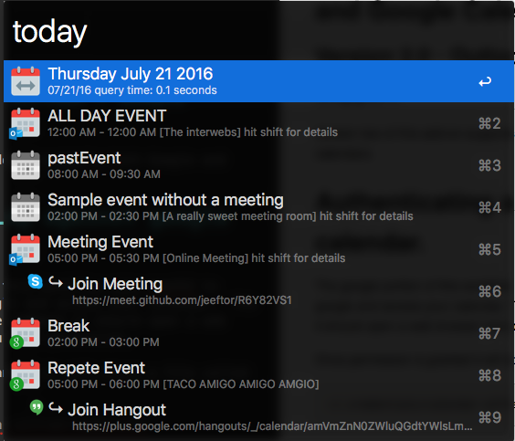
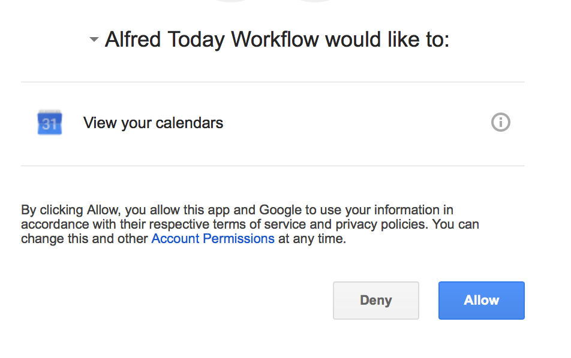
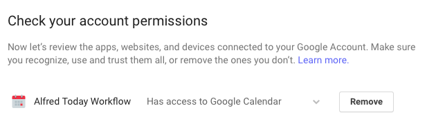
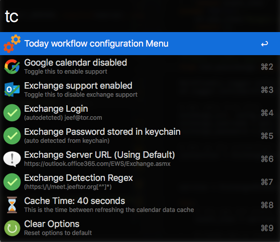
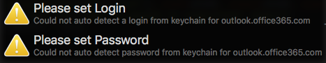
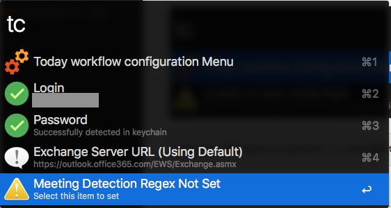
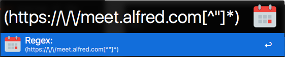

#Today Workflow for Outlook365 and Google Calendar




This workflow will load a **Today** view from both Exchange365 and Google calendars.  It will interleave the events, extract relevant meeting information and allow you to open links directly to your **Hangout** or **Skype** meeting - if one exists.


Version two of this add-on supports both **Google** and **Microsoft Exchange** calendars.  

###Version History
* Version 2.0 - Outlook + Google Support
* Version 2.0.1: Exchange Credential Fix
* Version 2.0.2: Dateutil.parser added to lib list
* Version 2.0.3: Correct event time interleaving

#Installation
Grab the latest release [here](https://github.com/jeeftor/alfredToday/releases) 

#Usage

You can use the following commands

Available Commands:

* **Today** (shows the today list)
* **Tomorrow** (shows list for tomorrow)
* **tc** (loads configuration)


#Authenticating against Google Calendar (oauth)

The Google portion of this workflow uses oauth2 to authenticate with google and access your calendar.  When you enabled Google support via the **tc** command the script "should" open a screen in your web browswer similar to



When you hit allow this will store a file in you home directory called 

```bash
~/.credentials/calendar-alfred-today.json
```
This file is an authorization key that will allow the software to work.  If you are running into issues please ask for help in the [issue](https://github.com/jeeftor/alfredToday/issues) section or on the [alfred forum link](http://www.alfredforum.com/topic/9271-today-view-for-google-calendar-and-microsoft-exchange/?p=46109).  

If you want to block access to this application perform a google [Security Checkup](https://security.google.com/settings/security/secureaccount) and look for the item similar to:



and click **Remove**.  

If you wish to re-authenticate make sure you remove the credentials file in your home directory


#Outlook

Use **today** to open the workflow and **tc** to open the config menu


This workflow will query an EWS (Exchange Web Service) and pull down a list of Today's meetings.

If you are using Skype/Lync and you set the correct regex it will also parse out the Meeting URL

You can click **shift** on an entry to load a **QuickLook** preview of the item.


# Configuration

You can see configuration items with the **tc** command and make changes



##**Username** and **Password**

The workflow will extract these entries out of the OSX keychain from the keychain entry for `outlook.office365.com`

If your keychain does not contain this value, or you wish to use a different account than that which is auto detected you can manually set a username and password.



If you've logged into the Outlook / Exchange online website you should have this value.  If auto-detect does not work just select both the **Login** and **Password** options to set the correct credentials for login. 

## Exchange Server

This workflow uses a version of PyExchange modified to use **Basic Authorization** instead of **NTLM** to connect to the exchange server.  According to Microsoft NTLM is only available for internal exchange servers - so its possible this workflow will only work with cloud hosted servers.  

The default server is `https://outlook.office365.com/EWS/Exchange.asmx`.  This _is_ a configurable option, however, I do not have any different exchange servers to test against so please let me know if it actually works


## Regex & detecting Online Meetings

If you are using Skype, Lync and a calendar entry has an embedded online meeting URL, the workflow can be configured to detect and extract these URLs.

For example if your online meeting URL is defined in text similar to 

    "http://meet.github.com/alfred/332344"

you could use a regex of

```perl
(https:\/\/meet.alfred.com[^"]*)
```
to extract these meeting URLs


Type **tc** to open the configuration menu, select the Regex Option

And enter your regex


This regular expression basically says:

```
  -- The () around the expression say to group everything inside
  -- look for anything that starts with http or https
  -- followed by ://
  -- followed by meet.github
  -- and then anything up until the 1st quotation mark
```


#Feedback & Help

Please open an [issue](https://github.com/jeeftor/alfredToday/issues) and/or post on [alfred forum link](http://www.alfredforum.com/topic/9271-today-view-for-google-calendar-and-microsoft-exchange/?p=46109).  You can also download a potentially not up to date versino from [Packal](http://www.packal.org/workflow/today-menu)

#Icons

Most icons in this project came from: [Icons8](https://icons8.com/web-app/new-icons/all)