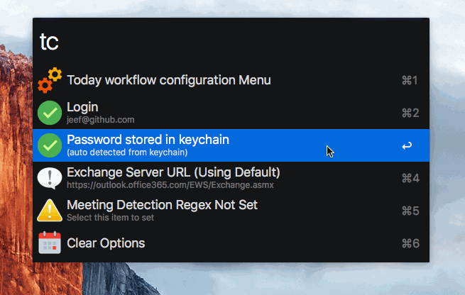

#Today Workflow


Use **today** to open the workflow and **tc** to open the config menu


This workflow will query an EWS (Exchange Web Service) and pull down a list of Today's meetings.

If you are using Skype/Lync and you set the correct regex it will also parse out the Meeting URL

You can click **shift** on an entry to load a **QuickLook** preview of the item.


# Usage

Available Commands:

* **Today** (shows the today list)
* **Tomorrow** (shows list for tomorrow)
* **tc** (loads configuration)

# Configuration

You can see configuration items with the **tc** command and make changes



##**Username** and **Password**

The workflow will extract these entries out of the OSX keychain from the keychain entry for `outlook.office365.com`

If your keychain does not contain this value, or you wish to use a different account than that which is auto detected you can manually set a username and password.


If you've logged into the Outlook / Exchange online website you should have this value.  If auto-detect does not work just select both the **Login** and **Password** options to set the correct credentials for login. 

## Exchange Server

This workflow uses a version of PyExchange modified to use **Basic Authorization** instead of **NTLM** to connect to the exchange server.  According to Microsoft NTLM is only available for internal exchange servers - so its possible this workflow will only work with cloud hosted servers.  

The default server is `https://outlook.office365.com/EWS/Exchange.asmx`.  This _is_ a configurable option, however, I do not have any different exchange servers to test against so please let me know if it actually works


## Regex & detecting Online Meetings

If you are using Skype, Lync and a calendar entry has an embedded online meeting URL, the workflow can be configured to detect and extract these URLs.

For example if your online meeting URL is defined in text similar to 

    "http://meet.github.com/alfred/332344"

you could use a regex of

```perl
(https:\/\/meet.alfred.com[^"]*)
```
to extract these meeting URLs


Type **tc** to open the configuration menu, select the Regex Option

And enter your regex


This regular expression basically says:

```
  -- The () around the expression say to group everything inside
  -- look for anything that starts with http or https
  -- followed by ://
  -- followed by meet.github
  -- and then anything up until the 1st quotation mark
```


#Feedback & Help

Please open an issue on `Github` and/or post on [alfred forum link](http://www.alfredforum.com/topic/9223-today-menu-for-microsoft-exchange-servers/)

